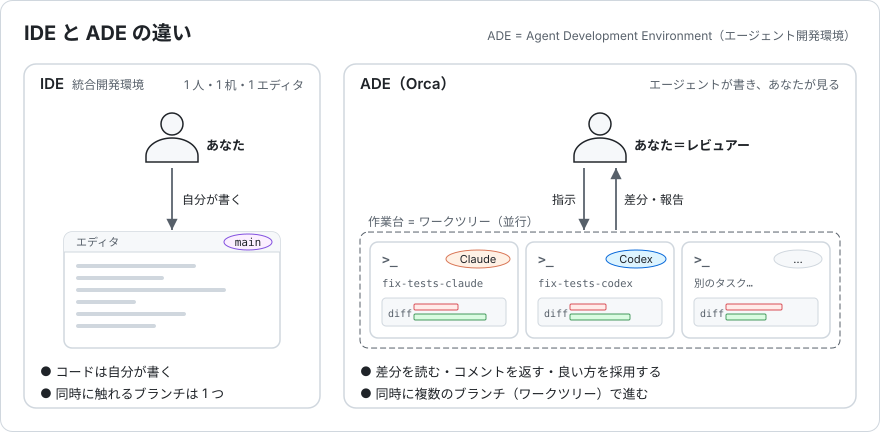
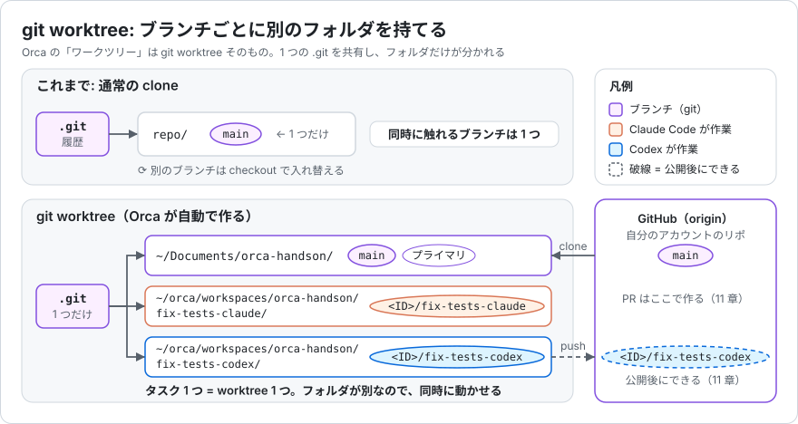
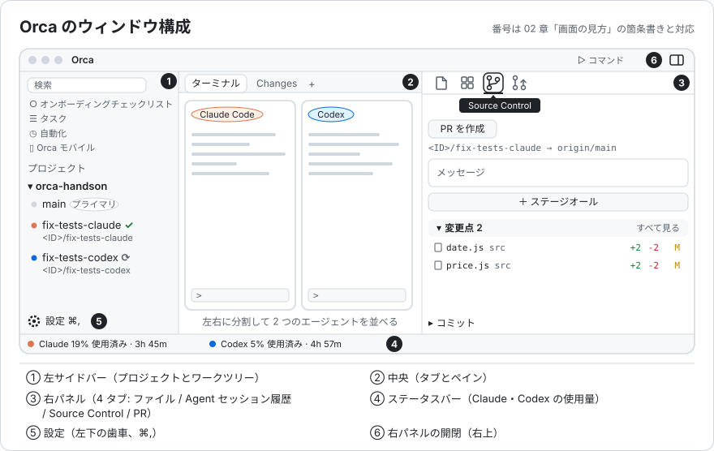
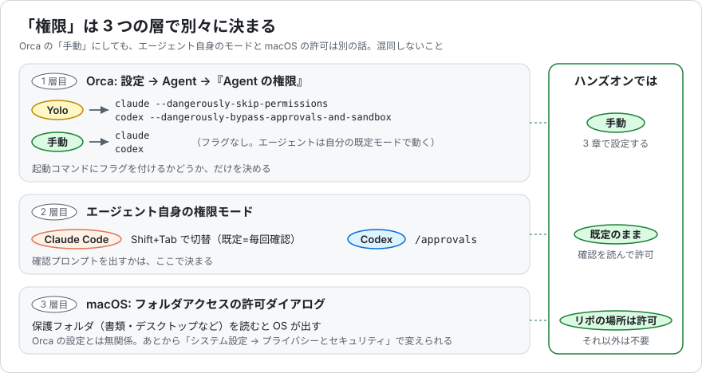

# Orca 概要 — ジュニアエンジニア向け

読む時間の目安: 15 分。読み終わったら [02_handson.md](./02_handson.md) に進んでください。

---

## 1. Orca とは

[Orca](https://www.onorca.dev/) は Stably AI が開発しているデスクトップアプリで、公式サイトは自らを
**ADE（Agent Development Environment）** と呼んでいます。IDE の I（Integrated）を A（Agent）に置き換えた造語で、
Claude Code や Codex のような CLI コーディングエージェントを **複数、同時に、互いに邪魔させずに走らせ、その成果を人が見比べて出荷する** ための道具です。

### IDE との違い

IDE は「自分がコードを書くための机」です。Orca は「複数の作業者に仕事を振り、途中経過を横目で見ながら、上がってきた成果物を検品する机」です。
机の上には作業者（エージェント）の数だけ作業台（worktree）が並び、それぞれにターミナル・ブラウザ・差分ビューが付いています。
自分でコードを書く時間より、**差分を読む・コメントを返す・良い方を採用する** 時間が長くなる前提の設計です。
公式ドキュメントも対象読者を「diff を読み、コミットを気にし、worktree を整理する人」と書いています。
エージェントに丸投げする道具ではなく、エージェントの上司になるための道具です。

---

## 2. 前提知識: git worktree とは

普段の git では `clone` すると作業ディレクトリが 1 つでき、ブランチを切り替えるとその中身が書き換わります。
つまり **同時に触れるブランチは 1 つ** です。エージェント A と B に別のブランチを任せても、同じディレクトリでは変更がぶつかります。

`git worktree` は、1 つの `.git` に **作業ディレクトリを複数ぶら下げる** 仕組みです。ディレクトリごとに別ブランチを checkout できるので、A と B が同時に作業できます。

Orca は **タスク 1 つにつき worktree 1 つ** を自動で作ります。中身は本物の git worktree なので `git status` や `git rebase` を普通に打てます。
ハンズオンでは、あなたが clone した `~/Documents/orca-handson` が本体（プライマリ）になり、ワークツリーは `~/orca/workspaces/orca-handson/<名前>` に作られます。

サイドバーでワークツリーを削除すると、ディレクトリとローカルブランチが一緒に消えます。**コミットしていない変更はそのまま消えます。**
コミット済みでまだマージされていないブランチだけは「Preserved branches」に退避され、消すかどうかは人が決めます。

---

## 3. 中核機能

Orca の画面は「左サイドバーでワークツリーを選び、中央でエージェントと差分を見て、右パネルでコミットと PR を作る」という配置です。

### ワークツリー（作業台）

Orca の日本語 UI では、登録したリポジトリを「プロジェクト」、worktree を「ワークツリー」または「ワークスペース」と呼びます。
プロジェクトを選んで ⌘N を押し、名前と使うエージェントを指定すると worktree ができます。ブランチ名は `<GitHub の ID>/<名前>` の形で、分岐元（base ref、通常 `origin/main`）は自動で決まります。作成先は既定で `~/orca/workspaces/<プロジェクト名>/<名前>` です。

### エージェントセッションと状態表示

「1 つの CLI エージェントが 1 つのターミナルで 1 つの worktree で動いている」単位をセッションと呼びます。
worktree 作成ダイアログの「Agent」欄でエージェントを選ぶだけで起動し、タブとサイドバーに同じ記号で状態が出ます。

| 表示 | 意味 |
|---|---|
| スピナー | 作業中 |
| ベル | 未読の完了通知がある（あなたの番） |
| 緑のチェック | 完了 |

エラーや停止中を含む一覧は [02_handson.md の 7-4](./02_handson.md#7-4-サイドバーで進み具合を見る) にあります。

### 分割ペインとジャンプ

タブを **右端にドラッグすると左右分割、下端なら上下分割** です。レイアウトは worktree ごとに保存されます。
worktree 間の移動は ⌘J（ジャンプパレット）、ファイルを開くのは ⌘P です。

### Diff viewer と Annotate AI Diff

各 worktree に分岐元との差分ビューが付いています。`j` / `k` でファイル、`n` / `p` でハンク（hunk。ひと続きになった変更のかたまり）を移動し、`s` でステージします。
行にマウスを乗せて行番号の左の「+」を押す（またはカーソルを置いて `c`）と、その行に Markdown でメモを書けます。
diff 上部の「Send」（英語 UI では Send to agent）を押すと **全メモが 1 つのプロンプトにまとまってエージェントに届きます**。1 件ずつ送るより修正が一貫する、と公式は勧めています。

### Source Control

ハンク単位でステージし、コミットメッセージはメッセージ欄の AI アイコン（英語 UI では Generate with AI）で作れます。push は「ブランチを公開」で `origin` へ行い、黙って force push はしません。
push 後は同じパネルの「PR を作成」で PR を作れます。GitHub 連携は設定 → 「連携」にあり、`gh` CLI のログインをそのまま使います。

### ワークツリーごとのブラウザと Design Mode（今日は使いません）

各 worktree に本物の Chromium が付き、Design Mode で UI 要素をクリックするとその HTML とスクリーンショットがエージェントに送られます。

### Orca CLI（付録 A で触れます）

同梱の `orca` コマンド（設定 → 一般 → Orca CLI の「シェルコマンド」を ON にして `/usr/local/bin/orca` に登録）で、`orca worktree create` や `orca terminal read` などが打てます。
**エージェント自身が worktree を切ったりブラウザを操作したりできる** のが ADE らしい点です。

### 動かす場所（今日は使いません）

既定は手元の Mac ですが、SSH 先で動かす構成、常時起動マシンに Orca サーバーを置いて PC・ブラウザ・スマホから繋ぐ構成もあります。

---

## 4. 対応エージェント

公式ドキュメントでは 40 種類以上の CLI エージェントに対応しているとされ、**Claude Code、Codex、Cursor CLI** は「深い統合」扱いです。
使用量とレート制限の残りがステータスバーに出て、複数アカウントも切り替えられます。
初回起動時の取り込みで `~/.claude` と `~/.codex` が参照されるので、ターミナルで一度ログイン済みなら Orca 側でトークンを入れ直す必要はありません。

---

## 5. 複数エージェントを「レース」させる

公式チュートリアルは最初の体験として、**同じタスクを複数エージェントに同時に解かせる** ことを勧めています。

1. 同じ分岐元から worktree を 2〜3 個作る
2. それぞれ別のエージェントを起動し、同じプロンプトを貼る
3. ペインを分割して並べて眺める
4. diff を見比べ、いちばん良い worktree に Annotate で仕上げの指示を出す
5. そこからコミット・push・PR を作り、残りの worktree は削除する

公式の説明はこうです。**エージェントごとに間違え方が違う** ので、1 つに何度もやり直させるより並べて走らせるほうが安くて速い。
**複数が同じ答えに収束したら正しさの手がかり**、**答えが分裂したら要件が曖昧だった手がかり** になる。
レースは速さを競う遊びではなく、レビューの目を養い仕様の穴を見つける手段です。ハンズオンでは Claude Code と Codex の 2 本で体験します。

---

## 6. 安全面の注意

### 既定は「Yolo」モード

Orca はコンボボックスからエージェントを起動するとき、**既定で権限確認を省くフラグを付けます。**
Claude Code なら `--dangerously-skip-permissions`、Codex なら `--dangerously-bypass-approvals-and-sandbox` です。
「worktree は使い捨てだから自由にやらせて diff で検品する」という設計思想ですが、ジュニアのうちは **エージェントが何をしようとしているかを確認プロンプトで読む経験** のほうが大事です。
そのためハンズオンでは最初に **設定 → Agent → 「Agent の権限」を「手動」**（英語 UI では Agent Permissions → Manual）にします。

「権限」に関わる設定は 3 つの層に分かれています。Orca の設定が決めるのは 1 層目だけです。

「手動」にすると Orca はフラグを付けずに `claude` / `codex` を起動します。その先で確認プロンプトが出るかどうかは、各エージェント自身の設定（2 層目）に従います。
権限スキップを試すなら、業務リポではなく使い捨ての worktree で、と覚えてください。

### 業務リポで使う前のチェックリスト

- [ ] 「Agent の権限」が手動か。Yolo にするなら、その worktree に本番の認証情報や `.env` が含まれていないか
- [ ] エージェントが `git push` や `rm -rf` のような取り消せない操作を確認なしにできる設定になっていないか
- [ ] 社内コードやプロンプトを外部 LLM に送ることが所属組織のルールで許可されているか（Orca ではなく Claude Code / Codex 側の話です）
- [ ] テレメトリの内容を確認し、必要なら無効化したか
- [ ] worktree を削除したとき、未コミットの変更は消え、コミット済み・未マージのブランチだけが「Preserved branches」に残る挙動を理解しているか

### テレメトリ

Orca は匿名の利用統計（アプリ起動、リポジトリの追加方法、起動したエージェントの種類、大まかなエラー分類、OS・CPU・バージョン）を PostHog の米国リージョンに送ります。
ファイルパス、リポジトリ名、ブランチ名、URL、コミットメッセージ、プロンプト、応答、ターミナル内容、メールアドレス、IP アドレス、ユーザー名は **送らない** と明記されています。
無効化は設定 → 「プライバシーとテレメトリ」→「匿名の使用状況データを共有する」をオフにするか、環境変数 `DO_NOT_TRACK=1` または `ORCA_TELEMETRY_DISABLED=1` を設定します。

---

## 7. 料金・ライセンス・リンク集

- 料金: **無料**。エージェント側（Claude Code、Codex など）の契約は各自のものを使います
- ライセンス: **MIT**。ソースコードは GitHub で公開されています
- 対応 OS: macOS（Apple Silicon / Intel）、Windows、Linux。iOS / Android のモバイル版もあります
- 開発元: Stably AI（サンフランシスコ、Y Combinator 出資）

| リンク | URL |
|---|---|
| 公式サイト | https://www.onorca.dev/ |
| ドキュメント | https://www.onorca.dev/docs |
| 最初のチュートリアル（3 エージェント） | https://www.onorca.dev/docs/first-session |
| 変更履歴 | https://www.onorca.dev/changelog |
| GitHub | https://github.com/stablyai/orca |
| Discord | https://discord.gg/fzjDKHxv8Q |
| X | https://x.com/orca_build |

Orca は更新頻度が高く、画面の表記や配置が変わることがあります。手順書と画面が食い違ったら、まず公式ドキュメントを確認してください。

---

次は [02_handson.md](./02_handson.md) に進んで、実際に手を動かしてください。
