# Orca ハンズオン — Claude Code と Codex に同じバグを直させて、良い方を PR にする

所要時間の目安: 60〜90 分（エージェントの待ち時間を含む）
確認環境: macOS（Apple Silicon）、Orca 1.4.199（日本語 UI）、Claude Code 2.1.x、Codex CLI 0.15x、Node.js 22

Orca は更新が速く、ボタンの文言や配置が変わることがあります。本書の表記は上記バージョンの実機で確認したものです。
画面と食い違ったら、英語ドキュメントの用語を（ ）で併記しているので、それを手がかりに [公式ドキュメント](https://www.onorca.dev/docs) を探してください。

---

## 0. このハンズオンのゴール

終わったときに、次のことが一人でできるようになっているのがゴールです。

- Orca にリポジトリを登録し、タスクごとに **ワークツリー（作業ディレクトリ）** を切れる
- 2 つのワークツリーで **Claude Code と Codex を同時に走らせ**、同じバグを直させる
- 2 つの差分を **見比べて良い方を選び**、差分の行に **コメントを付けてエージェントに修正させる**
- Orca の中から **コミット → push → PR 作成** まで済ませる
- 不要になったワークツリーを **後片付け** できる

### 用語の対応（先に押さえておく）

Orca の日本語 UI は、英語ドキュメントと呼び方が少し違います。

| 英語ドキュメント | Orca 日本語 UI | 意味 |
|---|---|---|
| Repo / Repository | **プロジェクト** | 登録した git リポジトリ |
| Worktree / Workspace | **ワークツリー**、**ワークスペース**（両方出てきます） | タスク 1 つ分の作業ディレクトリ。実体は `git worktree` |
| Agent | **Agent** | Claude Code や Codex などの CLI エージェント |
| Source Control | 右パネルのブランチアイコン | ステージ・コミット・push・PR |

---

## 1. 前提条件チェック（10 分）

ターミナル（Terminal.app や iTerm）で次を順に実行し、すべて通ることを確認します。

```bash
claude --version      # 2.x
codex --version       # codex-cli 0.15x
node --version        # v20 以上
git --version
gh --version
gh auth status        # "Logged in to github.com account <あなたのID>" が出れば OK
```

### `gh` が入っていない、またはログインしていない場合

```bash
brew install gh
gh auth login
```

`gh auth login` の質問は次のように答えます。

| 質問 | 答え |
|---|---|
| What account do you want to log into? | **GitHub.com** |
| What is your preferred protocol for Git operations? | **HTTPS** |
| Authenticate Git with your GitHub credentials? | **Yes** |
| How would you like to authenticate? | **Login with a web browser** |

表示されたワンタイムコードをブラウザに入力すれば完了です。もう一度 `gh auth status` を実行して確認してください。

> Orca の GitHub 連携（PR 作成、チェック表示）は、この `gh` のログインをそのまま使います。Orca 側で別途トークンを入れる必要はありません。

✅ **ここまでできたら**: 5 つのコマンドが全部通り、`gh auth status` に自分のアカウント名が出ている。

---

## 2. Orca のインストールと初回起動（10 分）

### インストール

どちらか一方で構いません。

```bash
# Homebrew の場合
brew install --cask stablyai/orca/orca
```

または [公式サイト](https://www.onorca.dev/) の「Download for macOS (Apple Silicon)」から `.dmg` を取得して Applications に入れます。

### 初回起動で聞かれること

1. **ホームディレクトリへのアクセス許可** … 許可します
2. **既存設定の取り込み**（`~/.claude`、`~/.codex`、Ghostty 設定）… 取り込みます。Claude Code と Codex のログイン情報がそのまま使えるようになります
3. 空の画面に「**プロジェクトを追加**」「**作成 workspace**」のボタンが出れば起動完了です

### 画面の見方

- **左サイドバー**: 上に「オンボーディングチェックリスト / タスク / 自動化 / Orca モバイル」、その下に「**プロジェクト**」一覧。プロジェクトの下にワークツリーがぶら下がります
- **中央**: 選んだワークツリーのタブ（ターミナル、Changes、エディタなど）
- **右パネル**（右上のアイコンで開閉）: 「ファイル / Agent セッション履歴 / Source Control / PR」の 4 タブ
- **下のステータスバー**: Claude と Codex の **使用量とレート制限の残り**。ここが便利です
- **左下の歯車**: 設定（`⌘,` でも開きます）

✅ **ここまでできたら**: Orca が起動し、左下の歯車から設定画面が開ける。

---

## 3. 安全設定（必須・5 分）

**この章を飛ばさないでください。** Orca は既定で、エージェントを起動するときに **権限確認を全部スキップするフラグ** を付けます。

設定（`⌘,`）→ 左の「**Agent**」を開き、下の方の「**Agent の権限**」を見てください。既定では **Yolo** が選ばれていて、「インストール済み」の欄に

- Claude: `claude --dangerously-skip-permissions`
- Codex: `codex --dangerously-bypass-approvals-and-sandbox`

と表示されています。これが「Yolo」の中身です。

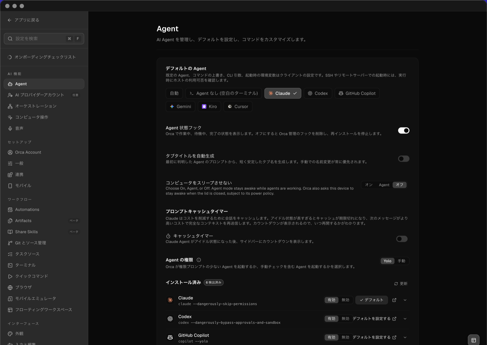

### 3-1. Agent の権限を「手動」にする

「**Agent の権限**」の右側のトグルで **手動** を選びます。すると「インストール済み」の表示が `claude`、`codex` だけになります。

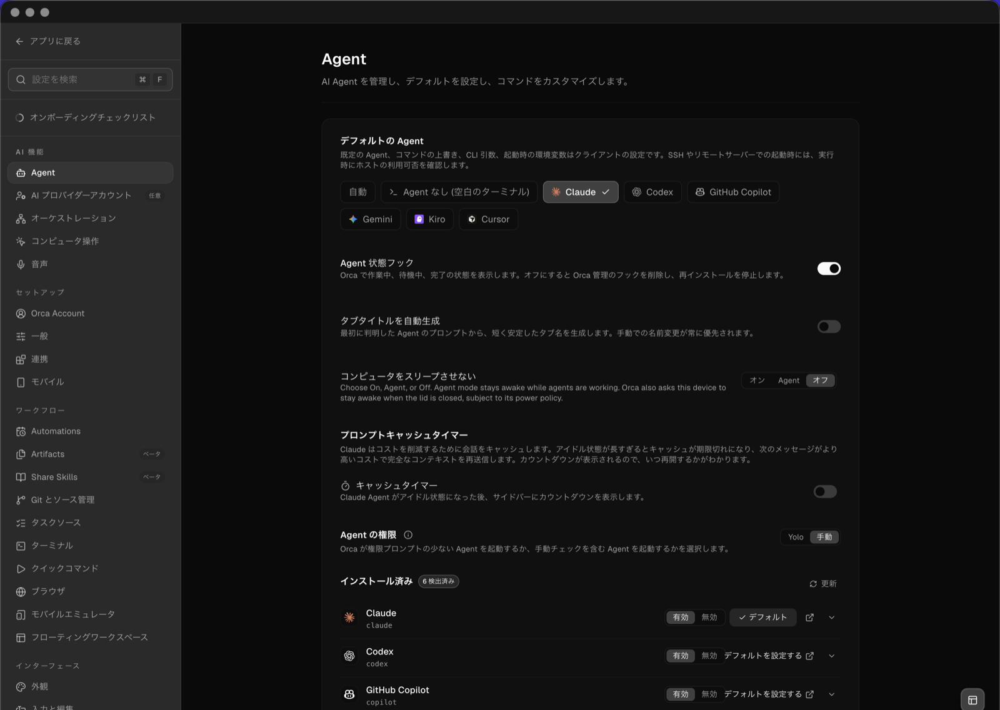

「手動」にすると、Orca は何もフラグを付けずにエージェントを起動します。**確認プロンプトが出るかどうかは、その先の Claude Code / Codex 自身の設定次第** です。
ジュニアのうちは、エージェントが「何をしようとしているか」を確認プロンプトで読む経験を積んでください。Yolo を使いたくなったときの指針は [付録 C](#付録-c-権限スキップyoloを使いたくなったら) にあります。

### 3-2. GitHub 連携を確認する

設定 → 「**連携**」を開き、「GitHub」が **Connected** になっていることを確認します。説明にあるとおり「PR、Issue、チェックは gh CLI」で動くので、1 章の `gh auth login` が済んでいれば自動的に Connected です。

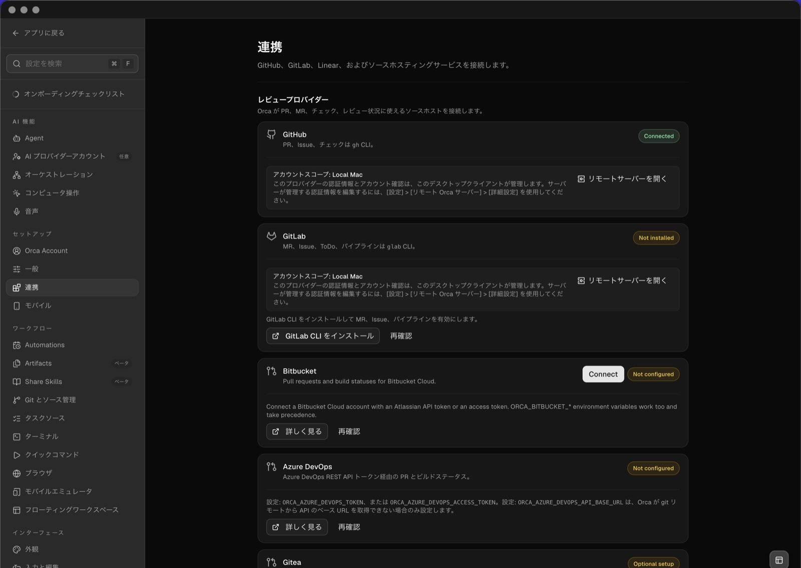

### 3-3. （任意）Orca CLI を登録する

設定 → 「**一般**」の下の方に「**Orca CLI**」があります。「シェルコマンド」のトグルを ON にすると `/usr/local/bin/orca` が登録され、ターミナルから `orca` コマンドが使えます。付録 A で使うので、ここで ON にしておくと後が楽です。

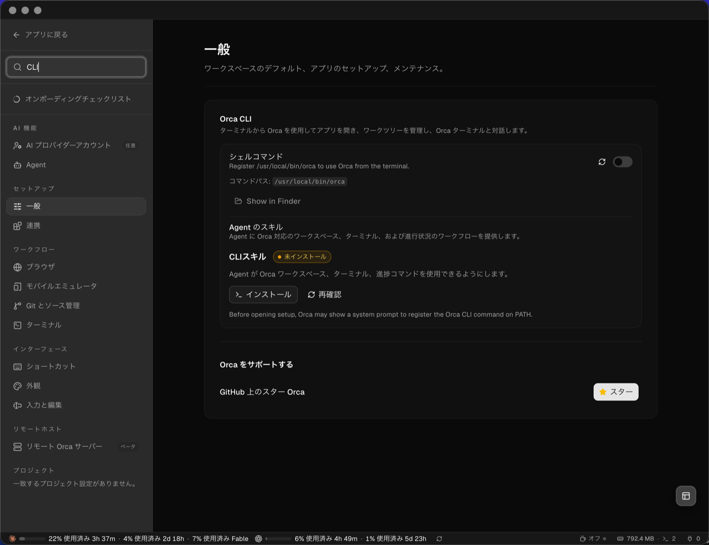

### 3-4. （任意）テレメトリ

設定 → 「**プライバシーとテレメトリ**」に「匿名の使用状況データを共有する」のトグルがあります。収集内容は [01_overview.md の 6 章](./01_overview.md#6-安全面の注意) を参照し、必要なら OFF にしてください。

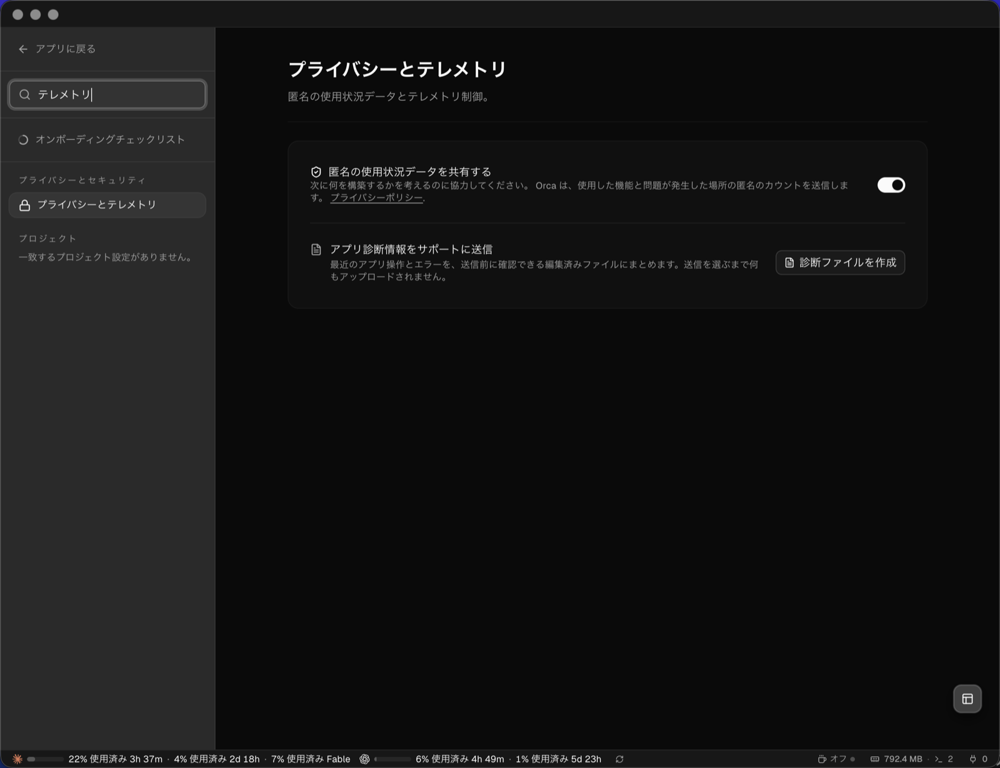

「**アプリに戻る**」で設定を閉じます。

✅ **ここまでできたら**: 「Agent の権限」が **手動**、「連携」の GitHub が **Connected**。

---

## 4. サンプルリポジトリを手に入れる（5 分）

この教材のテンプレートリポジトリから、**自分のアカウントに** 複製を作ります。テンプレートには、わざとバグを仕込んだ小さな Node.js アプリが入っています。

```bash
cd ~/Documents            # 好きな場所で構いません
gh repo create orca-handson --template misshii3/orca-handson --private --clone
cd orca-handson
npm test
```

`npm test` の最後に次のように出れば正常です。**5 件失敗するのが正しい状態** です。

```
ℹ tests 9
ℹ pass 4
ℹ fail 5
```

### 中身を 1 分だけ眺める

| ファイル | 役割 |
|---|---|
| `src/price.js` | `calcTaxIncluded`（税込計算）と `applyDiscount`（割引）。バグ 2 件 |
| `src/date.js` | `formatDate`（`YYYY-MM-DD` 形式）。バグ 1 件 |
| `test/*.test.js` | Node.js 標準の `node:test` によるテスト。**仕様はテストが正** |

どこがバグかは、まだ読まなくて大丈夫です。エージェントに探させ、あとで差分を読むのが今日の練習です。

✅ **ここまでできたら**: 自分の GitHub に `orca-handson` リポジトリができ、ローカルで `npm test` が **fail 5** で終わる。

---

## 5. Step 1: プロジェクトを追加する（Add Repo）

Orca に戻り、サイドバーの「プロジェクト」右側の **＋** か、中央の「**プロジェクトを追加**」を押します。

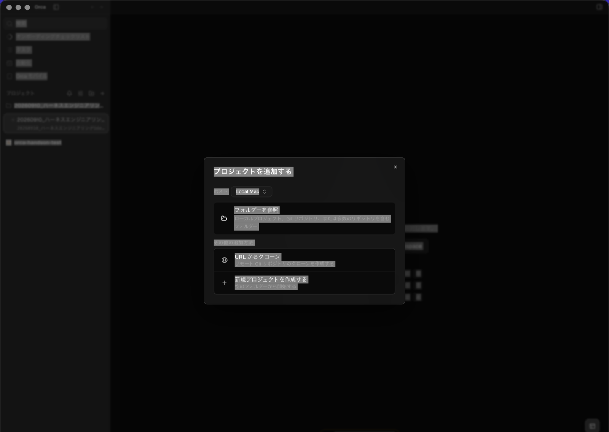

「**フォルダーを参照**」を選び、4 章でクローンした `orca-handson` フォルダを指定します。
（「URL からクローン」で GitHub の URL を貼っても構いません。その場合はクローン先を聞かれます）

サイドバーに `orca-handson` が現れ、その下に `main ［プライマリ］` と表示されます。この `main` があなたが clone した本体（プライマリチェックアウト）で、以後作るワークツリーはここから分岐します。

✅ **ここまでできたら**: サイドバーに `orca-handson` → `main ［プライマリ］` が見える。

---

## 6. Step 2 + 3: ワークツリーを作って Claude Code を起動する

### 6-1. 作成ダイアログを開く

サイドバーで `orca-handson` をクリックして選び、**`⌘N`**（または中央の「作成 workspace」）を押します。

「**ワークツリーを作成する**」ダイアログが開きます。項目は上から次のとおりです。

| 項目 | 入れる値 |
|---|---|
| プロジェクト | `orca-handson`（自分のリポ）になっているか確認。違えばドロップダウンで選ぶ |
| 実行先 | `Local Mac` のまま |
| 名前または「作成元」 | タブを「**名前**」にして `fix-tests-claude` と入力 |
| Agent | **Claude** |
| 詳細設定 | 触らない |

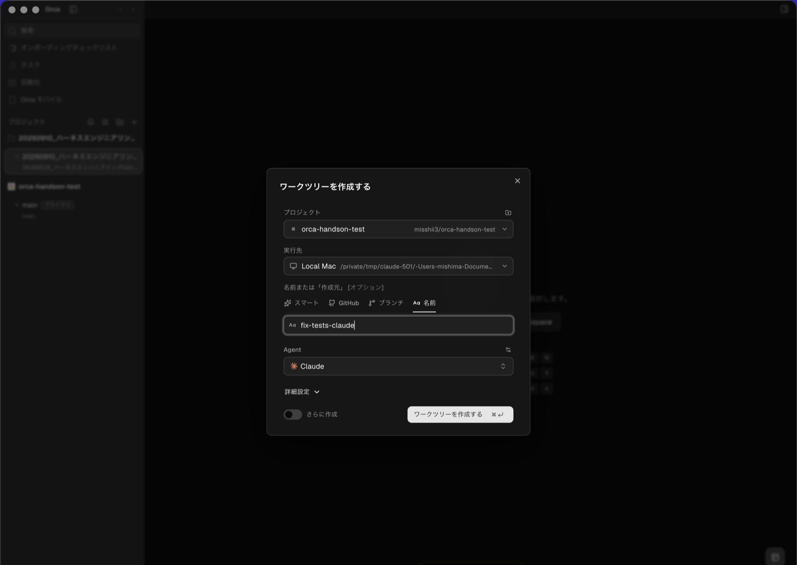

> タブの「スマート」は Issue 番号やブランチ名からワークツリーを作る機能、「GitHub」は Issue / PR から作る機能です。今日は「名前」だけ使います。

「**ワークツリーを作成する ⌘↩**」を押します。

### 6-2. 作成直後に起きること

- サイドバーに `fix-tests-claude` が追加され、その下にブランチ名 `<あなたのGitHubID>/fix-tests-claude` が出ます。**ブランチ名は Orca が自動で付けます**
- 左下に「**セットアップスクリプトを追加する**」というポップアップが出ることがあります（`package.json` から `npm install` を検出したもの）。このサンプルは依存パッケージがないので **× で閉じて** 構いません
- 中央にターミナルタブが開き、`claude` が自動で起動します

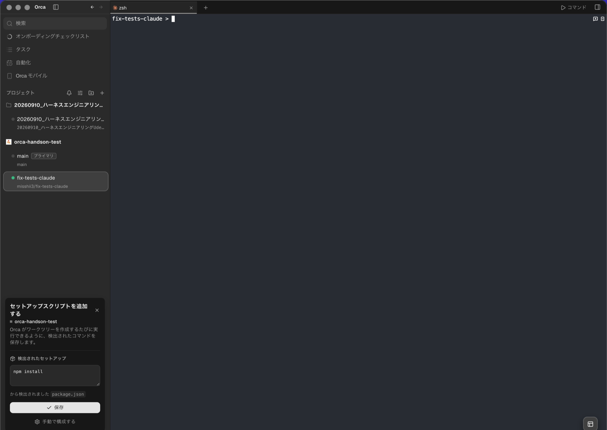

### 6-3. Claude Code の初回確認に答える

初めてのディレクトリで Claude Code を起動すると「**Quick safety check: Is this a project you created or one you trust?**」と聞かれます。自分で clone したリポジトリなので、↓キーで「**Yes, I trust this folder**」を選んで Enter します。


1 行目に `fix-tests-claude > claude` と出ていることを確認してください。`--dangerously-skip-permissions` が **付いていない** のが、3 章で「手動」にした効果です。

### 6-4. macOS の許可ダイアログが出たら

エージェントが動き始めると、macOS から「**"Orca.app" から、"書類" フォルダ内のファイルへのアクセス権を求められています**」のようなダイアログが出ることがあります。これは Orca（とその中で動くエージェント）が保護フォルダを読もうとしたときの OS の確認です。

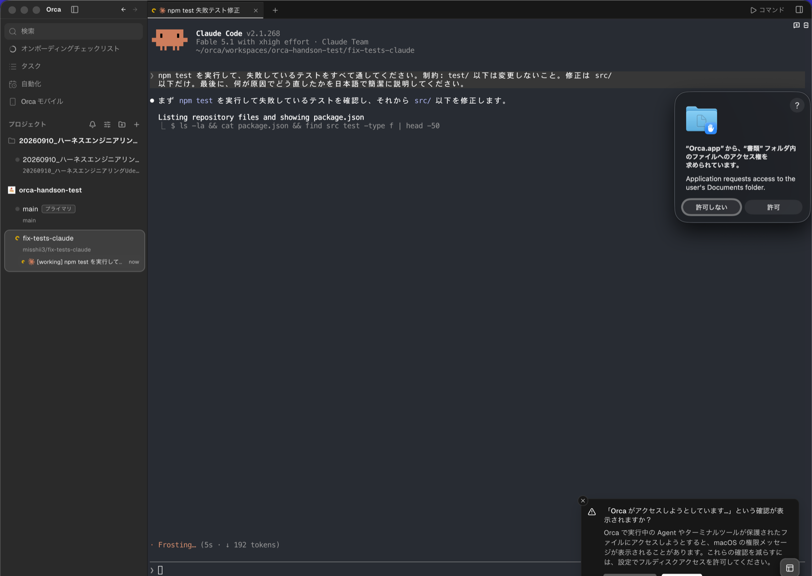

- 「書類」「デスクトップ」など、**自分のリポジトリを置いた場所** へのアクセスは **許可** してください。拒否すると、そのフォルダにあるプロジェクトで Orca が動けなくなります
- 「"Orca.app" が "Codex Computer Use.app" を制御するアクセスを要求しています」は Codex のコンピュータ操作機能に関するものです。今日のハンズオンには不要なので、**許可しなくても進められます**。所属組織の PC 運用ルールに従ってください
- あとで変えたいときは、macOS の「システム設定 → プライバシーとセキュリティ」で変更できます

✅ **ここまでできたら**: サイドバーに `fix-tests-claude`、中央に Claude Code の起動画面（`❯` のプロンプト）。

---

## 7. Step 4: レース開始 — Claude Code と Codex に同じ指示を出す

### 7-1. Claude Code に指示を貼る

Claude Code のプロンプトに、次の文をそのまま貼って Enter します。

```
npm test を実行して、失敗しているテストをすべて通してください。制約: test/ 以下は変更しないこと。修正は src/ 以下だけ。最後に、何が原因でどう直したかを日本語で簡潔に説明してください。
```

Claude Code が `npm test` を実行しようとすると、**確認プロンプトが出る場合があります**（あなたの Claude Code の権限モードが既定のときです）。内容を読んで、問題なければ許可してください。これが「エージェントが何をしようとしているかを読む」練習です。

> 画面下に `auto mode on (shift+tab to cycle)` などと出ている場合、それはあなたの **Claude Code 自身の設定** です。`Shift+Tab` で確認モードを切り替えられます。Orca の「手動」設定とは別の層の話なので、混同しないでください。

### 7-2. 2 本目のワークツリーで Codex を起動する

Claude が動いている間に、もう一度 **`⌘N`** を押します。今回はプロジェクトが最初から `orca-handson` になっているはずです。

| 項目 | 入れる値 |
|---|---|
| 名前 | タブを「名前」にして `fix-tests-codex` |
| Agent | ドロップダウンを開いて **Codex** を選ぶ |

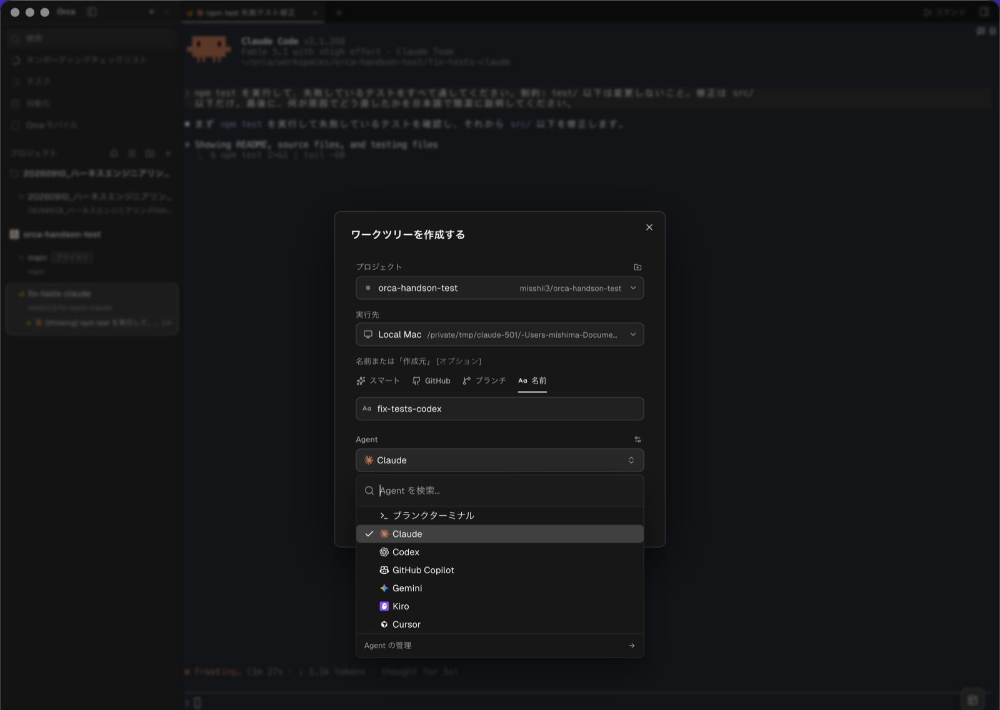

「ワークツリーを作成する ⌘↩」を押すと、`fix-tests-codex` ができて `codex` が起動します。Codex のプロンプト（`» Ask Codex to do anything`）に **同じ文** を貼って Enter します。

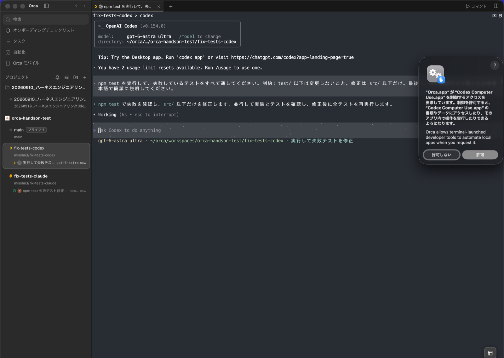

### 7-3. サイドバーで進み具合を見る

2 つのワークツリーの状態は、サイドバーのアイコンだけで追えます。

| サイドバーの表示 | 意味 |
|---|---|
| 回転するスピナー | 作業中 |
| 緑のチェック | 完了（待機中） |
| 黄色いアイコン、`[thinking]` `[working]` の文字 | 考え中・実行中の詳細 |
| ベル | 未読の完了通知がある |
| Codex の下にぶら下がる `default` の行 | Codex が起動したサブエージェント。Orca は子行として表示します |

タブの名前は、最初の指示から Orca が自動で付けます（例: 「npm test 失敗テスト修正」）。

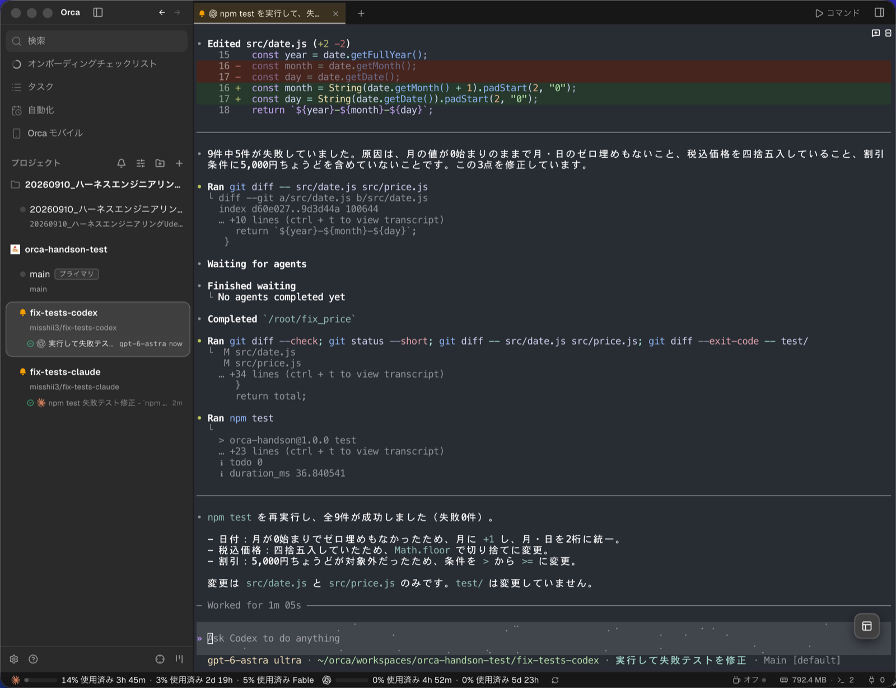

今回の実測では、Claude Code は約 2 分、Codex は約 1 分で完走し、どちらも **9 件すべて成功** させました。

✅ **ここまでできたら**: 2 つのワークツリーに緑のチェックが付き、各ターミナルに日本語の修正説明が出ている。

---

## 8. Step 5: 2 つを並べて見る

エージェントの様子を同時に見たいときは、**タブをドラッグして分割** します。

- 中央のタブ（ターミナルのタブ）を、ペインの **右端** までドラッグすると左右分割、**下端** までドラッグすると上下分割です
- 分割の境目は好きな位置にでき、レイアウトはワークツリーごとに保存されます
- ワークツリー間の移動は **`⌘J`**（ジャンプパレット）。名前を打って Enter で切り替え、**Shift+Enter** なら新しい分割で開きます
- タブの切り替えは `⌘⇧]` / `⌘⇧[`

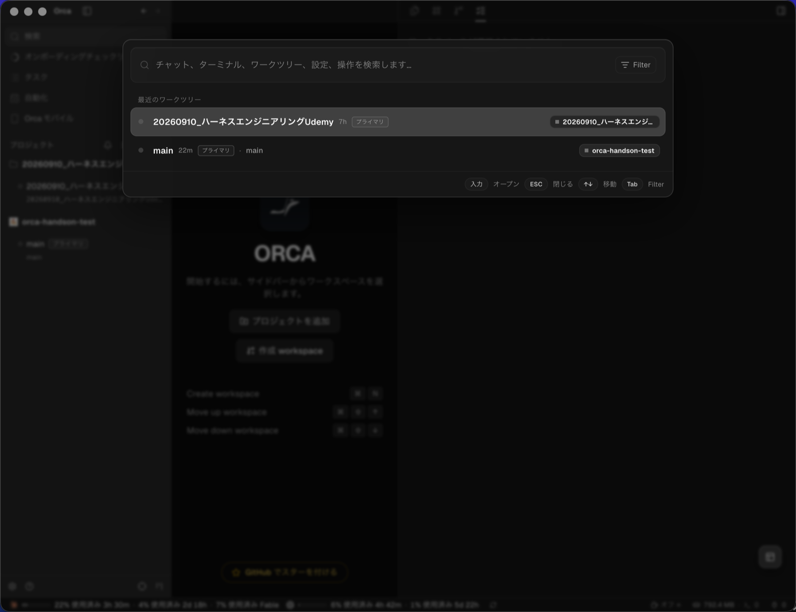

> `⌘J` を押しても何も出ないときは、ターミナルにキー入力が吸われています。サイドバーの空いている所を一度クリックしてから押してください。

✅ **ここまでできたら**: Claude と Codex のターミナルを左右に並べて表示できた。

---

## 9. Step 6: 差分を読んで比べる（Diff viewer）

### 9-1. Source Control パネルを開く

右上のパネル開閉アイコンで右パネルを開き、上部 4 つのうち **3 番目のブランチアイコン** を押すと Source Control パネルになります。

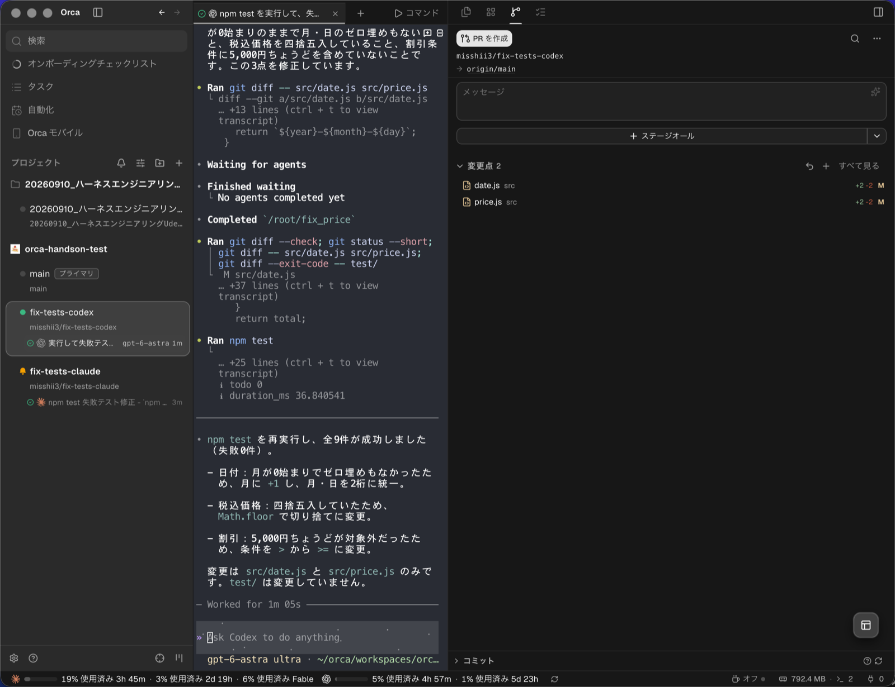

見えるもの:

- 一番上の「**PR を作成**」ボタン
- `<ID>/fix-tests-codex → origin/main`（このブランチと、分岐元）
- 「メッセージ」欄（右上に AI 生成のアイコン）
- 「**＋ ステージオール**」
- 「**変更点 2**」と、変更されたファイル（`date.js +2 -2`、`price.js +2 -2`）

### 9-2. 統合 diff を開く

「変更点」の右の「**すべて見る**」を押すと、中央に **Changes** タブが開き、全ファイルの差分が縦に並びます。

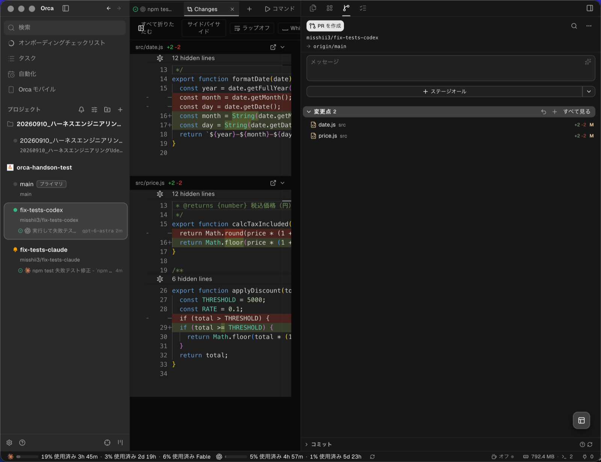

ツールバーの機能:

| ボタン | 働き |
|---|---|
| すべて折りたたむ | 変更のない行を隠す |
| インライン / サイドバイサイド | 表示方式の切り替え。右パネルを閉じてペインを広げるとサイドバイサイドが読みやすい |
| ラップオフ | 長い行の折り返し |
| Whitespace Off | 空白の差分を表示するか |

キーボードでも移動できます。`j` / `k` で次・前のファイル、`n` / `p` で次・前のハンク、`s` でカーソル下のハンクをステージ。

### 9-3. 2 つのワークツリーを見比べる

サイドバーで `fix-tests-claude` と `fix-tests-codex` を切り替え、それぞれの Changes を見てください。見る観点は 3 つです。

1. **正しいか**: 境界値（5,000 円ちょうど）、端数処理（切り捨て）、月の 0 始まりが直っているか
2. **余計なことをしていないか**: `test/` を触っていないか、無関係なファイルに差分がないか
3. **読めるか**: なぜそう直したかが、コードやコメントから分かるか

今回の実測では、**ロジックの修正は 2 つとも同じ** でした。違いは、Claude Code は各修正行に日本語コメントを添え、Codex はコメントなしの最小差分だったことです。
どちらを「良い」とするかはチームの方針次第です。ここでは **Codex の方を採用し、足りないコメントを次の Step で足させる** ことにします（Claude を採用しても手順は同じです）。

✅ **ここまでできたら**: 2 つの差分を見比べ、採用する方を決めた。

---

## 10. Step 7: 差分の行にコメントして、エージェントに直させる（Annotate AI Diff）

採用した方（ここでは `fix-tests-codex`）の Changes タブを開きます。

### 10-1. 行にノートを付ける

`src/date.js` の `const month = String(date.getMonth() + 1)...` の行にマウスを乗せると、行番号の左に **＋** が出ます（キーボードなら行にカーソルを置いて `c`）。

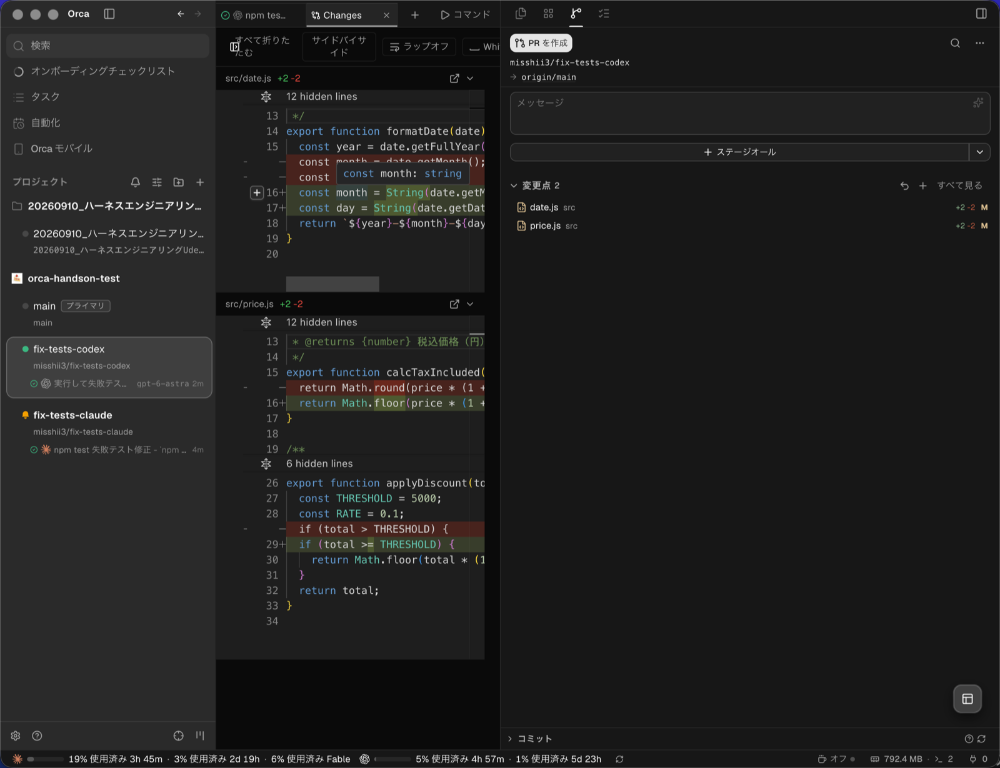

＋ を押すと「**16 行目 / Add note for the AI**」の入力欄が開きます。次のように書いて「**Add note ↵**」を押します。

```
なぜ getMonth() に +1 が必要なのか、初見の人にも分かる日本語コメントをこの行の上に追加してください。
```

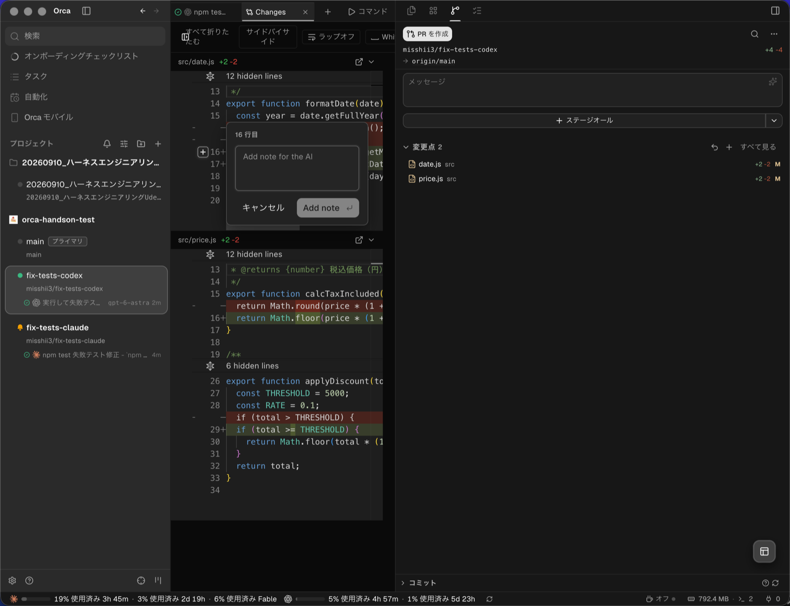

ノートはその行に固定され、diff の中に「Note line 16」として表示されます。ツールバーには「**AI メモ 1**」と「**Send**」が現れ、Source Control パネルにも「ノート 1」が出ます。

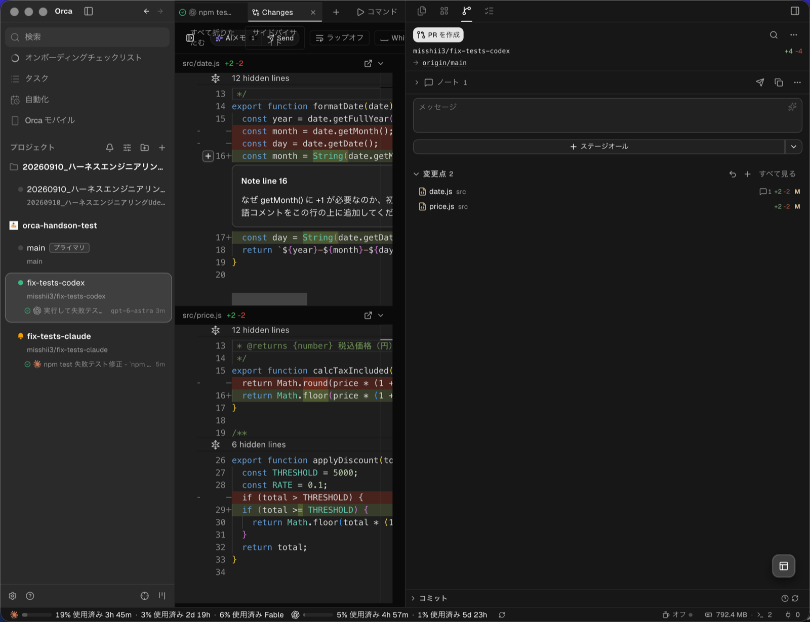

> ペインが狭いとツールバーのボタンが重なって押しにくいことがあります。右パネルを閉じるか、ウィンドウを広げてください。サイドバイサイド表示にすると、ノートは右側に大きく表示されます。

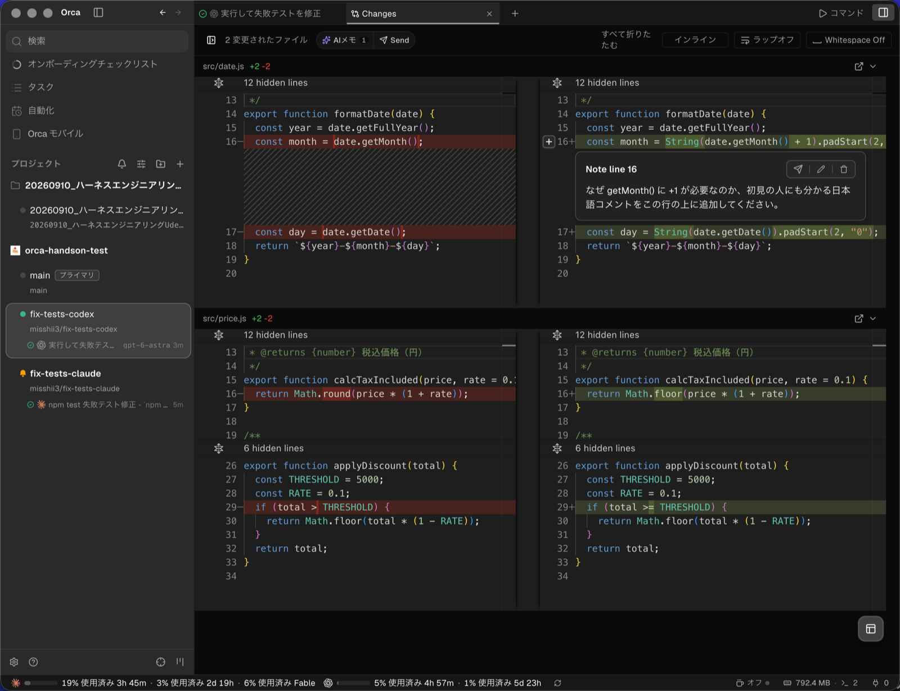

### 10-2. まとめて送る

気になる行が複数あるなら、**全部にノートを付けてから** 送ります。1 件ずつ送るより、エージェントが全体を見て一貫した修正をしてくれるからです。

ツールバーの「**Send**」を押すと「**メモの送信先**」メニューが開きます。

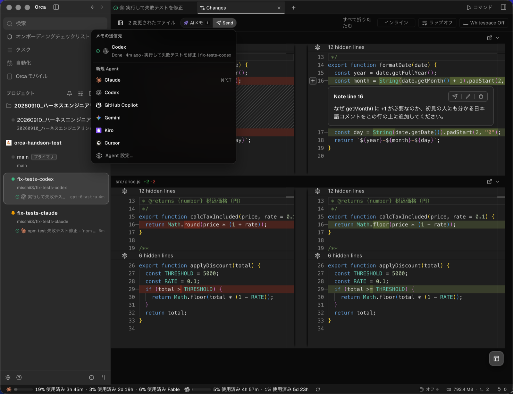

- 上段: このワークツリーで **すでに動いているエージェント**（ここでは `Codex · Done · 実行して失敗テストを修正`）
- 下段「新規 Agent」: 別のエージェントを新しく起動して渡す

上段の Codex を選びます。右下に「**メモをアクティブな Agent に送信しました**」と出て、Codex のターミナルに

```
File: src/date.js
Line: 16
User comment: "なぜ getMonth() に +1 が必要なのか、..."
```

という形で届き、Codex が作業を始めます。数十秒で `date.js` にコメント行が追加され、Changes の `date.js` が `+3 -2` に変わります。

✅ **ここまでできたら**: Codex がコメント行を追加し、Changes にその差分が出ている。

---

## 11. Step 8: コミット → push → PR 作成

すべて Source Control パネル（右パネルのブランチアイコン）で行います。

### 11-1. ステージする

「**＋ ステージオール**」を押します。見出しが「**ステージ済みの変更 2**」に変わり、ボタンが「**✓ Commit**」になります。

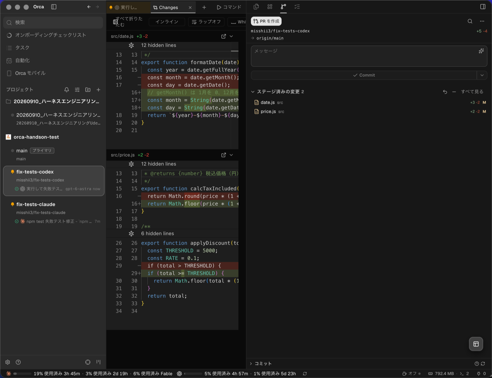

### 11-2. コミットメッセージを AI に書かせる

「メッセージ」欄の右上の **AI アイコン**（きらきらマーク）を押します。初回だけ「**コミットメッセージの生成**」ダイアログが出て、使う Agent（既定は Claude）とプロンプトのテンプレートを確認できます。そのまま「**Generate**」を押してください。

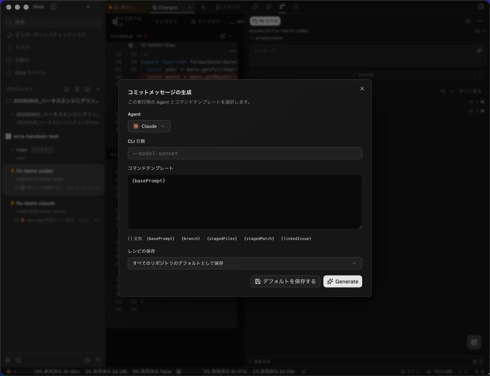

10〜20 秒でメッセージが入ります。**必ず読んで**、事実と違えば直してください。

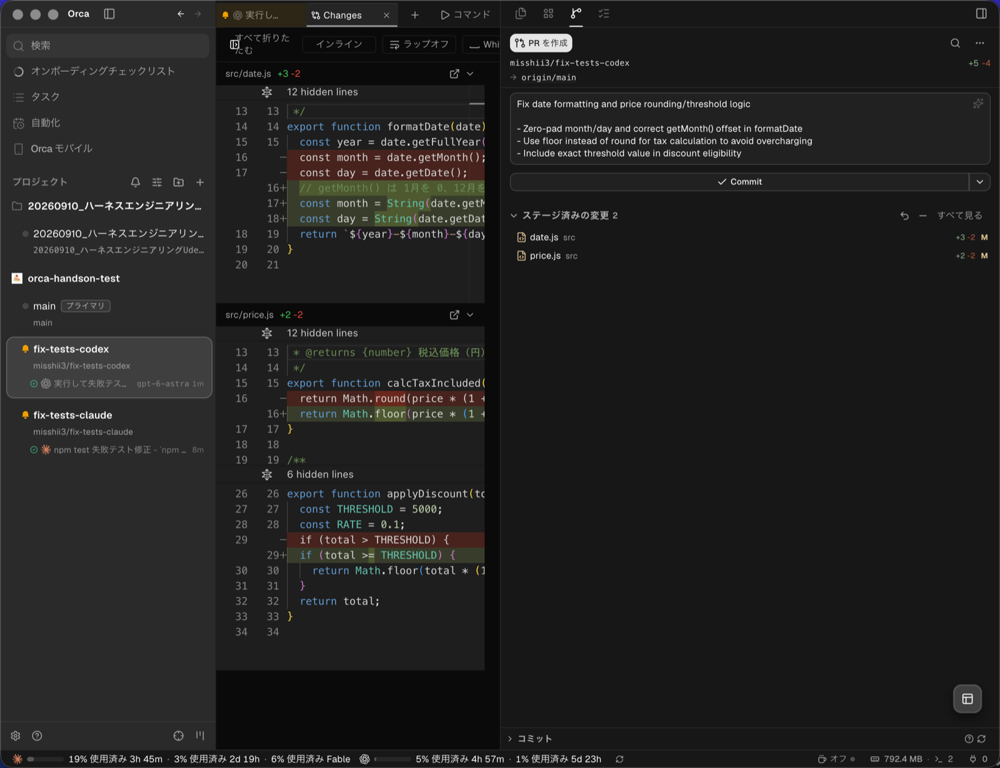

「**Commit**」を押します（`⌘↩` でも可）。

### 11-3. push する

コミットすると、ボタンが「**ブランチを公開**」に変わり、右上に `↑1`（未 push のコミット数）が出ます。

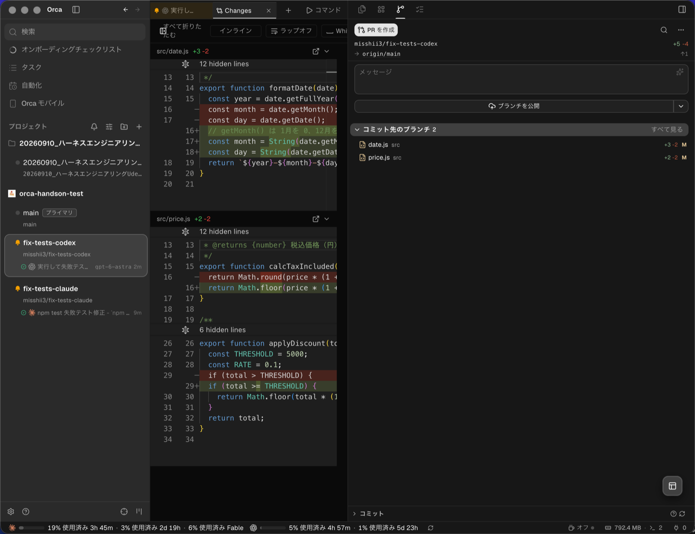

「ブランチを公開」を押すと `origin` にブランチが push されます。Orca は **黙って force push はしません**。履歴を書き換えたときだけ「Force push with lease」が別に出ます。

### 11-4. PR を作る

パネル上部の「**PR を作成**」を押します。確認環境では **確認ダイアログなしで即座に PR が作られ**、タイトルはブランチ名から（例: `Fix tests codex`）、本文は空でした。

- パネル上部の表示が「**PR #1**」に変わり、サイドバーのワークツリーに PR アイコンが付きます
- 右パネルの **4 番目のアイコン（PR）** を押すと、PR の状態（OPEN）、チェックの結果、コメント、「Create merge commit」ボタンが見えます

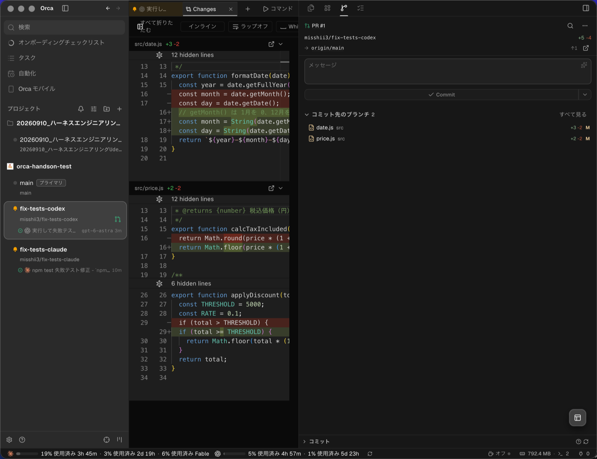

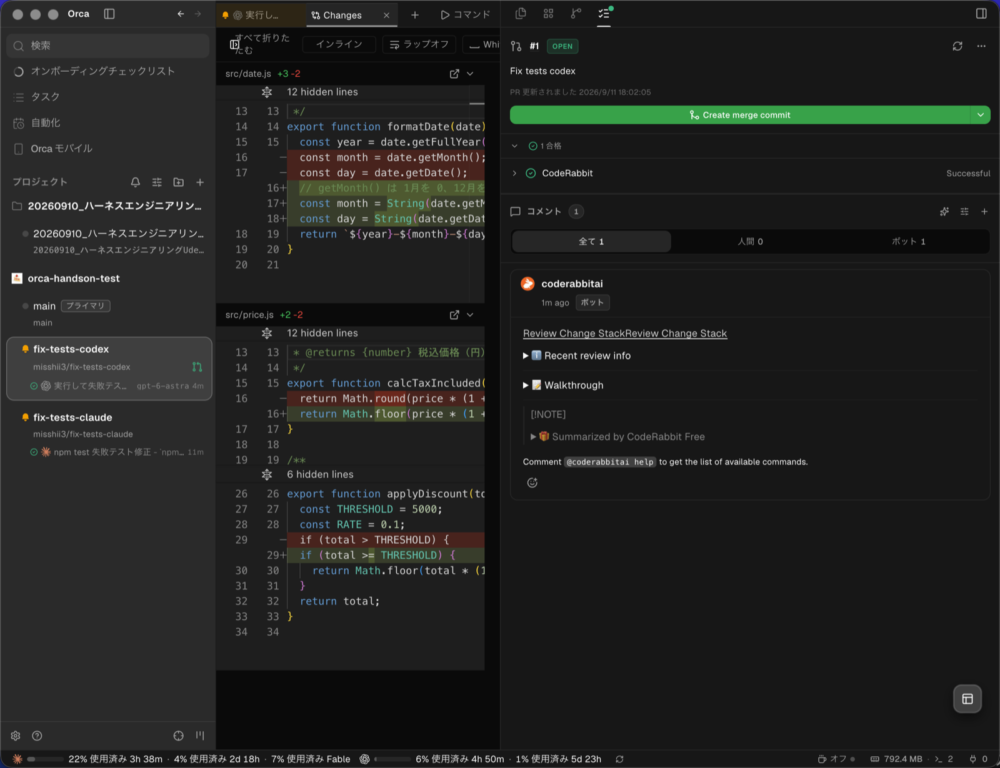

> 画像に写っている「CodeRabbit」は、筆者の GitHub アカウントに入っているレビューボットです。参加者の環境には出ません。

> バージョンによっては、作成前にタイトル・説明・下書きかどうかを確認するダイアログが出て、「AI で PR の説明を生成」できます。出た場合は説明を生成して内容を確認してから作成してください。
> 今回のように本文が空で作られた場合は、PR パネル右上の外部リンクアイコンから GitHub で開き、説明を書き足してください。ターミナルからなら `gh pr edit 1 --body "..."` でも書けます。

ブラウザで `https://github.com/<あなたのID>/orca-handson/pulls` を開き、PR ができていることを確認します。差分は自分の目で最後にもう一度読んでください。

✅ **ここまでできたら**: 自分の GitHub に PR が 1 件でき、Orca の PR パネルに OPEN と表示されている。

---

## 12. Step 9: 後片付け

不採用にした `fix-tests-claude` を消します。サイドバーで **右クリック** → 一番下の「**削除 ⌘⇧⌫**」。

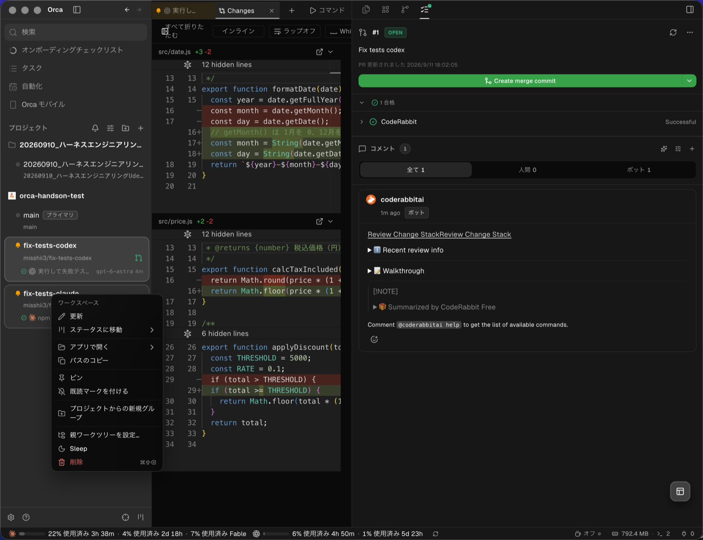

確認ダイアログが出るので OK します（設定「一般」→「ワークスペースを削除する前に確認する」が既定で ON）。

このとき起きること:

- `~/orca/workspaces/orca-handson/fix-tests-claude` ディレクトリが消える
- ローカルブランチ `<ID>/fix-tests-claude` も消える。push していないので、リモートには何も残っていません
- マージされていないコミットを含むブランチは、git が削除を拒否した場合「Preserved branches」に退避され、消すかどうかを後で決められます

ターミナルで確かめると、Orca のワークツリーが本物の `git worktree` だったことが分かります。

```bash
cd ~/Documents/orca-handson
git worktree list
git branch
```

採用した `fix-tests-codex` は、PR をマージした後に同じ手順で消してください。PR のマージは PR パネルの「Create merge commit」か、GitHub 上で行えます。

プロジェクトごと Orca から外したいときは、サイドバーのプロジェクト名にマウスを乗せて右に出る「**…**」→「**プロジェクトの削除**」です。Orca の一覧から外れるだけで、clone したフォルダは残ります（確認ダイアログの文言を読んで確かめてください）。

✅ **ここまでできたら**: サイドバーに `main` と `fix-tests-codex` だけが残っている。

ここまでで本編は終わりです。お疲れさまでした。

---

## 付録 A（任意）: Orca CLI をエージェントから使う

3-3 で Orca CLI を登録していれば、ターミナルから Orca 自身を操作できます。Orca の中のエージェントも同じコマンドが使えるので、「エージェントがワークツリーを切って別のエージェントを走らせる」といった使い方ができます。

```bash
orca status --json                     # Orca が動いているか
orca worktree ps --json                # 全ワークツリーとエージェントの状態
orca worktree create --repo name:orca-handson --name from-cli --agent claude --prompt "README.md を読んで要約して" --activate --json
orca terminal list --json              # 生きているターミナル
orca terminal read --screen --json     # いま見えている画面を文字で取得
orca terminal send --text "続けて" --enter --json
```

登録していない場合は、フルパスでも動きます。

```bash
/Applications/Orca.app/Contents/Resources/bin/orca status --json
```

セッション復元も試してみてください。Orca を `⌘Q` で終了して再起動すると、ワークツリー、タブ、ターミナルのスクロールバックが戻り、終了したエージェントには「再起動」のチップが出ます。

---

## 付録 B: トラブルシューティング

| 症状 | 見るところ・直し方 |
|---|---|
| エージェントが起動しない、`command not found` | Orca の「ブランクターミナル」を開いて `which claude` `which codex` を打つ。出なければ PATH の問題。ターミナルアプリでは動くのに Orca で動かないときは、シェルの設定ファイル（`~/.zshrc`）に PATH を書いてから Orca を再起動 |
| ワークツリーの作成に失敗する | プライマリの `main` で `git fetch origin` を実行してから再試行。同名のワークツリーが残っていないかも確認 |
| 「PR を作成」が反応しない、GitHub のエラーが出る | ターミナルで `gh auth status`。`GITHUB_TOKEN` や `GH_TOKEN` 環境変数に古い値が入っていると gh のログインより優先されて失敗する。`unset GITHUB_TOKEN GH_TOKEN` してから `gh auth login` をやり直す |
| GitHub のレート制限（rate-limiting）と言われる | しばらく待つ。`gh api rate_limit` で残量を確認できる |
| macOS の許可ダイアログが何度も出る | 「システム設定 → プライバシーとセキュリティ → フルディスクアクセス」に Orca を追加すると出なくなる（組織のルールを確認） |
| Changes の差分が古い、変わらない | 差分ツールバーの更新アイコンを押す。外で `git rebase` や `reset` をした直後は反映が遅れることがある |
| `orca` コマンドが見つからない | 設定 → 一般 → Orca CLI のトグルが ON か確認。`/usr/local/bin` が PATH にあるか確認。急ぐならフルパスで実行 |
| ワークツリーのターミナルで日本語入力がおかしい | IME を英数に切り替えてから入力。長文はメモ帳に書いて貼り付けるのが確実 |
| エージェントの確認プロンプトが一切出ない | 設定 → Agent → 「Agent の権限」が **手動** か確認。手動でも出ないなら、Claude Code / Codex 自身の設定（Claude は `Shift+Tab` のモード、Codex は `/approvals`）を確認 |
| 何が起きたか分からない | メニューの Help → Open Logs でログを見る。Help → Send Feedback でスクリーンショット付きで開発元に送れる |

---

## 付録 C: 権限スキップ（Yolo）を使いたくなったら

Orca の設計思想は「ワークツリーは使い捨てだから、エージェントには自由にやらせて、**差分で検品する**」です。Yolo はその思想の表れで、慣れた人が使えば速いのは事実です。

ただし、次の条件を満たすときだけにしてください。

1. **業務リポジトリでは使わない**。練習用・使い捨てのワークツリーに限る
2. そのワークツリーから届く範囲に、本番の認証情報や `.env` が **ない**
3. `git push --force` や `rm -rf` のような **取り消せない操作** をエージェントがしても困らない状態である
4. 終わったら **必ず差分を全部読む**。読まないなら Yolo を使う資格はまだない、と考える

Yolo に切り替える場所は、設定 → Agent → 「Agent の権限」です。ハンズオンが終わったら **手動に戻す** のを忘れないでください。

---

## 参考リンク

- 公式チュートリアル「Your first 3-agent session」: https://www.onorca.dev/docs/first-session
- レシピ「Race three agents on the same task」: https://www.onorca.dev/docs/recipes/parallel-agents
- Annotate AI Diff: https://www.onorca.dev/docs/review/annotate-ai-diff
- Commit & push from Orca: https://www.onorca.dev/docs/review/commit-push
- Troubleshooting GitHub errors: https://www.onorca.dev/docs/github-errors
- Orca CLI overview: https://www.onorca.dev/docs/cli/overview
