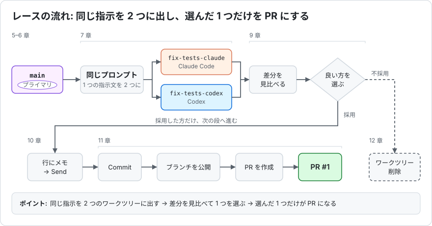

# Orca ハンズオン（ジュニアエンジニア向け・自習用）

[Orca](https://www.onorca.dev/) は、Claude Code や Codex などの CLI コーディングエージェントを
タスクごとに独立した git worktree で **並列に走らせ、差分を読んで、PR まで出す** ためのデスクトップアプリです。

このリポジトリは、Orca を初めて触る人が一人で進められるように作った教材です。
資料と一緒に、意図的にバグを仕込んだ小さな Node.js サンプル（`src/`, `test/`）が入っています。

## 何を体験するか

同じバグ修正を Claude Code と Codex に同時にやらせ、差分を見比べて良い方を選び、行にコメントを付けて仕上げさせ、Orca の中から PR を作るところまでを一人で通します。



## 進め方（合計 約 2 時間）

1. [01_overview.md](./01_overview.md) を読む（15 分）
   Orca が何を解決するツールなのか、git worktree とは何か、安全面で気をつけることを図解で押さえます。
2. [02_handson.md](./02_handson.md) を上から順に進める（60〜90 分）
   準備（1〜4 章）→ 本編（5〜12 章）→ 付録の順です。手順ごとに実機のスクリーンショット（`images/`）と「ここまでできたら」のチェックポイントを置いています。

## このリポジトリの使い方（参加者向け）

このリポジトリは **テンプレートリポジトリ** です。自分のアカウントに複製してから使います。
詳しい手順は `02_handson.md` の 4 章にありますが、要点だけ書くと次のコマンドです。

```bash
gh repo create orca-handson --template misshii3/orca-handson --private --clone
cd orca-handson
npm test   # 失敗するテストがあるのが正常です
```

## ファイル構成

```
orca-handson/
├── README.md            # このファイル
├── 01_overview.md       # Orca の概要（15 分で読む）
├── 02_handson.md        # ハンズオン手順（60〜90 分）
├── images/              # 実機のスクリーンショット（02 から参照）
│   └── diagrams/        # 図解（SVG）
├── package.json         # npm test の定義。依存パッケージなし
├── src/
│   ├── price.js         # 税込計算と割引計算（バグあり）
│   └── date.js          # 日付フォーマット（バグあり）
└── test/
    ├── price.test.js    # 仕様はテストが正
    └── date.test.js
```

## サンプルアプリについて

| ファイル | 内容 |
|---|---|
| `src/price.js` | 税込計算と割引計算（バグ 2 か所） |
| `src/date.js` | 日付フォーマット（バグ 1 か所。1 か所に問題が 2 つ） |
| `test/*.test.js` | Node.js 標準の `node:test` によるテスト。**仕様はテストが正** |

依存パッケージはありません。Node.js 20 以上で `npm test` が動きます。
テンプレートの状態では 9 テスト中 5 件が失敗します（バグは 3 か所）。答えは `02_handson.md` の 9 章末尾にあります。

## 動作確認環境

- macOS（Apple Silicon）
- Orca 1.4.199（日本語 UI）
- Claude Code 2.1.x / Codex CLI 0.15x
- Node.js 22

Orca は更新頻度が高く、画面の表記が変わることがあります。手順と画面が合わないときは
[公式ドキュメント](https://www.onorca.dev/docs) を確認してください。

## ライセンス

MIT
